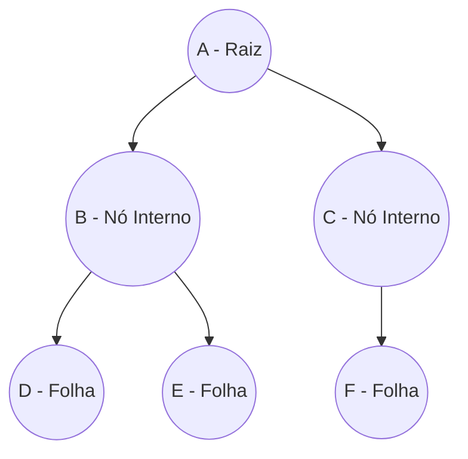
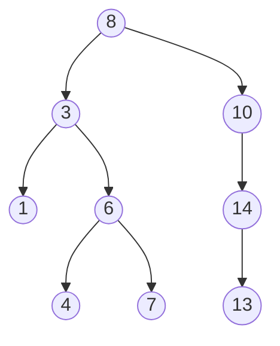

# Resumo: Árvores em Ciência da Computação

Este resumo foi gerado com base no material fornecido sobre introdução a árvores e árvores binárias.

## 1. Introdução às Árvores
Uma **árvore** é uma estrutura de dados não linear que dispõe os dados de forma hierárquica. Diferente das listas (lineares e sequenciais), as árvores permitem resolver problemas de maneiras distintas e representam melhor estruturas com subordinação ou composição.

### 1.1 Características e Definição
- **Recursividade:** A definição matemática de árvore é recursiva. Uma árvore $T$ é um conjunto finito de nós que pode ser vazio. Caso não seja, existe um nó chamado **raiz**, e os demais nós são particionados em conjuntos disjuntos que também são árvores (sub-árvores descendentes).
- **Teoria dos Grafos:** Na Teoria dos Grafos, uma árvore é um grafo **direcionado**, **conexo** e **acíclico**. Em estruturas de dados, trabalhamos geralmente com **árvores enraizadas** (um único nó raiz do qual todos os outros descendem direta ou indiretamente).

### 1.2 Aplicações
- Hierarquia de pastas (sistema operacional).
- Árvores genealógicas e organogramas.
- Composição de peças e dependências.
- Topologia de redes.
- Classificação taxonômica de espécies.
- Análise sintática de expressões.
- Árvores de decisão em Inteligência Artificial.

### 1.3 Terminologia Básica
- **Raiz:** Nó principal do qual todos os outros descendem. Não possui pai.
- **Pai e Filho:** Nó que origina outro (pai) e nó originado diretamente (filho).
- **Folha:** Nó que não possui filhos (grau zero).
- **Nó Interno:** Nó que possui pelo menos um filho (não é folha).
- **Grau de um nó:** Número de filhos que o nó possui.
- **Grau da árvore (n-aridade):** Maior grau encontrado entre todos os nós da árvore.
- **Caminho:** Sequência de nós distintos que conectam um nó a outro.
- **Nível:** Distância do nó até a raiz (em gerações). A raiz está no nível 0.
- **Altura (ou Profundidade):** Maior nível encontrado na árvore (ex: se o maior nível é 3, a árvore tem altura 3).

**Exemplo de Terminologia:**

- **Pai de D:** B
- **Filhos de A:** B e C
- **Folhas (grau 0):** D, E, F
- **Grau do nó B:** 2
- **Caminho de A até E:** A $\rightarrow$ B $\rightarrow$ E
- **Altura da Árvore:** 2 (Nível de A=0, B e C=1, D, E e F=2)

---

## 2. Árvores Binárias e de Busca Binária
Uma **Árvore Binária** é um tipo específico de árvore onde o **grau máximo é 2**. Cada nó pode ter, no máximo, um *filho da esquerda* e um *filho da direita*.

### 2.1 Árvore de Busca Binária (BST - Binary Search Tree)
Uma árvore binária de busca impõe propriedades estruturais aos seus nós:
1. **Sub-árvore esquerda:** Possui apenas nós com valores **menores** que o nó pai.
2. **Sub-árvore direita:** Possui apenas nós com valores **maiores ou iguais** ao nó pai.
3. Cada sub-árvore é, também, uma árvore binária de busca.

**Exemplo de Árvore de Busca Binária:**

*Observe que todos os nós na sub-árvore à esquerda do `8` são menores que ele (1, 3, 4, 6, 7), e na direita são maiores (10, 13, 14).*

### 2.2 Modelagem e Operações Principais
A modelagem em representação encadeada utiliza uma classe `Nó` (armazena valor e referências para filho esquerdo e direito) e uma classe `Arvore` (gerencia a referência à raiz e o tamanho).

**Principais Operações:**
- **Verificação de árvore vazia:** Testa se a raiz referencia `null` ou se o tamanho é zero.
- **Inserção:** Novos elementos são sempre inseridos como **nós folhas**. A lógica desce pela árvore recursivamente ou iterativamente (para a esquerda se menor, para a direita se maior) até encontrar a posição adequada (um `null`).
- **Busca:** Começa na raiz e navega para a esquerda (se procurado < nó) ou direita (se procurado >= nó) até encontrar o elemento ou chegar em `null`.
- **Maior Elemento:** Retornado ao navegar da raiz apenas pelas sub-árvores à direita até não haver mais filhos. O mesmo vale para o Menor Elemento, mas para a esquerda.
- **Exclusão:** É a operação mais complexa, dividida em 3 casos, após encontrar o nó desejado:
  1. **Nó Folha:** Basta anular a referência para este nó no seu pai.
  2. **Nó com 1 filho:** Substitui-se a referência no pai pelo único filho do nó a ser excluído.
  3. **Nó com 2 filhos:** Substitui-se o valor do nó excluído pelo valor do seu **antecessor** (maior valor da sub-árvore esquerda) ou **sucessor** (menor valor da sub-árvore direita). Em seguida, exclui-se o antecessor/sucessor em sua posição original, que fatalmente recairá no caso 1 ou 2.

### 2.3 Percorrimento (Travessia)
Processo sistemático de visitar/processar todos os nós da árvore uma única vez. Existem três tipos básicos:
- **Em ordem (Simétrica):** Percorre a sub-árvore esquerda, processa a raiz, percorre a sub-árvore direita (Ex: `a + b`). Gera os elementos de forma ordenada crescente em uma BST.
- **Pré-ordem:** Processa a raiz, percorre a esquerda, percorre a direita (Ex: `+ a b`).
- **Pós-ordem:** Percorre a esquerda, percorre a direita, processa a raiz (Ex: `a b +`).

**Exemplo de Travessias (usando a BST ilustrada anteriormente):**
- **Em ordem:** `1, 3, 4, 6, 7, 8, 10, 13, 14` *(os dados são gerados em ordem crescente!)*
- **Pré-ordem:** `8, 3, 1, 6, 4, 7, 10, 14, 13` *(muito útil para clonar/copiar uma árvore)*
- **Pós-ordem:** `1, 4, 7, 6, 3, 13, 14, 10, 8` *(útil para exclusão da árvore inteira, apagando das folhas até a raiz)*

---

## Sugestões de Novos Conceitos para Aprofundamento

Se você deseja continuar estudando árvores em Ciência da Computação, aqui estão conceitos intimamente relacionados e evoluções naturais do assunto:

1. **Árvores Balanceadas (Ex: AVL e Red-Black Trees):**
   - *Por que estudar:* O pior caso de uma árvore de busca binária simples ocorre quando inserimos dados já ordenados; ela se degrada em uma lista encadeada, perdendo a eficiência ($O(n)$). Árvores balanceadas resolvem isso aplicando rotações automáticas durante inserções e remoções para garantir que a altura da árvore seja sempre próxima de $O(\log n)$.

2. **Heaps (Min-Heap e Max-Heap):**
   - *Por que estudar:* São árvores binárias "quase completas" essenciais para a implementação de estruturas como **Filas de Prioridade (Priority Queues)** e também baseiam um dos algoritmos de ordenação mais eficientes, o *Heapsort*.

3. **Árvores B e B+ (B-Trees):**
   - *Por que estudar:* São árvores n-árias (com nós podendo ter muitos filhos) fundamentais para **Bancos de Dados e Sistemas de Arquivos**. São projetadas especificamente para minimizar o número de leituras em discos rígidos (I/O) quando lidamos com volumes massivos de dados.

4. **Trie (Árvore de Prefixos):**
   - *Por que estudar:* Uma árvore especializada na armazenagem de conjuntos de strings. Extremamente eficiente para pesquisas de texto, dicionários computacionais, rotas de IP e criação de recursos de "auto-completar" (autocomplete) em barras de pesquisa.

5. **Travessia em Largura (BFS - Breadth-First Search):**
   - *Por que estudar:* Enquanto Pré, Pós e Em-Ordem são buscas em "profundidade", a travessia em largura acessa os dados "nível por nível". É uma ótima forma de revisar o uso de filas (Queues) junto com árvores.

6. **Árvores Geradoras Mínimas (MST) e Algoritmos de Grafos:**
   - *Por que estudar:* Como toda árvore é um grafo, entender como encontrar árvores geradoras mínimas (através de algoritmos como **Kruskal** ou **Prim**) é essencial para resolver problemas de infraestrutura (redes, rotas), que minimizam o custo de interligar vários nós.
